## 0x150 Getting your hands dirty

<aside>
🗒️

Click on the hyperlink of the C file name to see the source code.

</aside>

The [`firstProg.c`](firstProg.c) program is a simple C code that will print “`Hello, World!`” ten times.

Compiling the code using GCC.

```shell
> gcc firstProg.c -o firstProg

> ./firstProg
```

- In UNIX/WSL, it requires `gcc` installed through `build-essentials`
    ```bash
    $ sudo apt install build-essentials
    ```
- In PowerShell, installing `gcc` can be done through MinGW by following one of the guides below.
    - [GeeksforGeeks](https://www.geeksforgeeks.org/cpp/installing-mingw-tools-for-c-c-and-changing-environment-variable/){:target="_blank"}
    - [phoenixNAP](https://phoenixnap.com/kb/install-gcc-windows){:target="_blank"}

### 0x151 The bigger picture

Compiling the `firstProg` object with `objdump`, which is a GNU compiler to examine the executables/binaries that translates the high-level programming language, as in C, into the low-level language, as in the machine code. I've tested the following commands on how to examine the binaries in two different OSes.

- Bash
    ```bash
    $ objdump -D firstProg | grep -A20 main.:
    ```
- PowerShell (which I tried to use according to the image examples)
    ```powershell
    PS C:\..\> objdump -D .\firstProg.exe | Select-String -Pattern 'main.:' -Context 0,20
    ```

In this directory guide, I've compiled using different options, including:

- Using AT&T syntax (default option)
    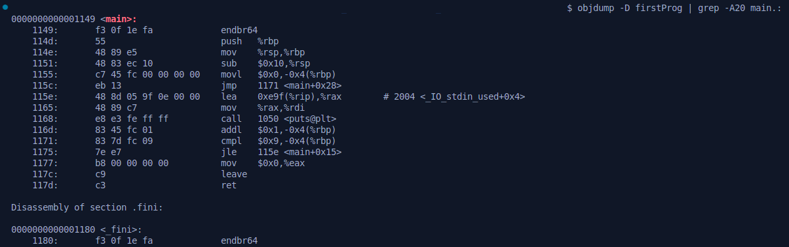

- Using Intel syntax (add `-M intel` option flag on the previous `objdump` command)
    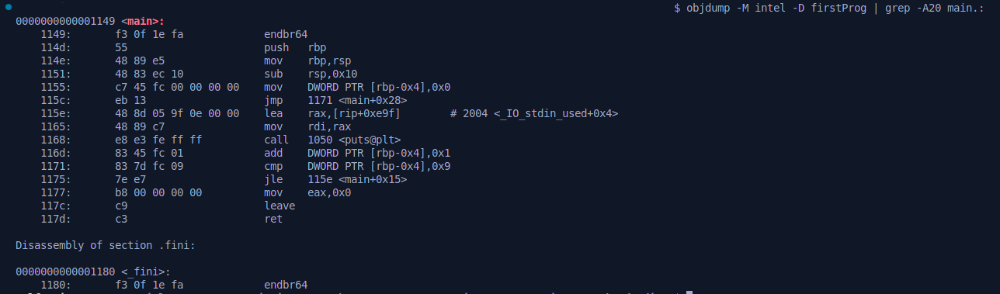


Let’s define each sections of the results of `objdump` output command.

- The `objdump` displays **only 20 lines after the regular expression (regex) `main.:`**.
- **Memory addresses**: The far-left side of the output (`0x1149`) is the address that stores the bits of the machine language instructions.
- **Hexadecimal notation** bits (`0x55`, then `0x48 0x89 0x85`) that are stored in the respective memory addresses, are the **language instructions** on the respective processor (**x86_64 processor**).
    - While x86 architecture uses 32-bit processors, which have 2^32 possible addresses, the x86_64 architecture uses 64-bit processors, which have 2^48 possible addresses.
    - Some x86_64 architecture can run 32-bit compatibility mode, which enables them to run 32-bit code rapidly.
- On the far-right side, these are the instructions in Assembly language.

The Assembly language, which is a collection of mnemonics for the corresponding machine language instructions.

- This means depending on the architecture, the Assembly have direct one-to-one relationship with their corresponding machine language instructions.
- Based on the examples above, the AT&T and Intel syntax have different representations of the Assembly syntaxes.
    - The Assembly language of AT&T syntax has the cacophony/noise of `%` and `$` symbols prefixing everything, compared to the Intel, which has none of them.
- Regardless of the Assembly language representation, the instructions consists of an operation, and additional arguments that defines the source and destination of the operation.
    - These operations move memory around, perform some mathematical tasks, or interrupt the processor to work on something else.
    - Processors also have special variables called ***registers***, that they use it to read or write data.

### 0x152 The x86 (and x86_64) processor

The x86 processor/architecture starts from the 8086 CPU, manufactured by Intel. It starts with the 8086 CPU, which later developed more advanced processor in the same family, including 80186, 80286, 80386, and 80486.

According to the information I found on [Wikipedia](https://en.wikipedia.org/wiki/X86-64){:target="_blank"}, the x86_64 (also known as x64, AMD64, and Intel 64) is a 64-bit extension of the x86 instruction set. It was introduced for the first time in the AMD Opteron family in 1999, which provides significantly larger amounts of virtual memory and physical memory compared to its predecessors. This allows programs to utilize more memory for data storage.

Both architectures have several (or more in latter architectures) registers, which can be examined through debugging.

The ***debugger*** tools are used by programmers to step through compiled programs, examine program memory, and view processor registers. The GNU development tools has a debugger called **GDB**.
- The same tool allows a hacker to observe the smallest point-of-view of machine code, which they can view the execution from all angles, pause it, and change anything along the way.

An example of the GDB to display the state of the processor registers right before the program starts.

- x86 architecture (from the book)
    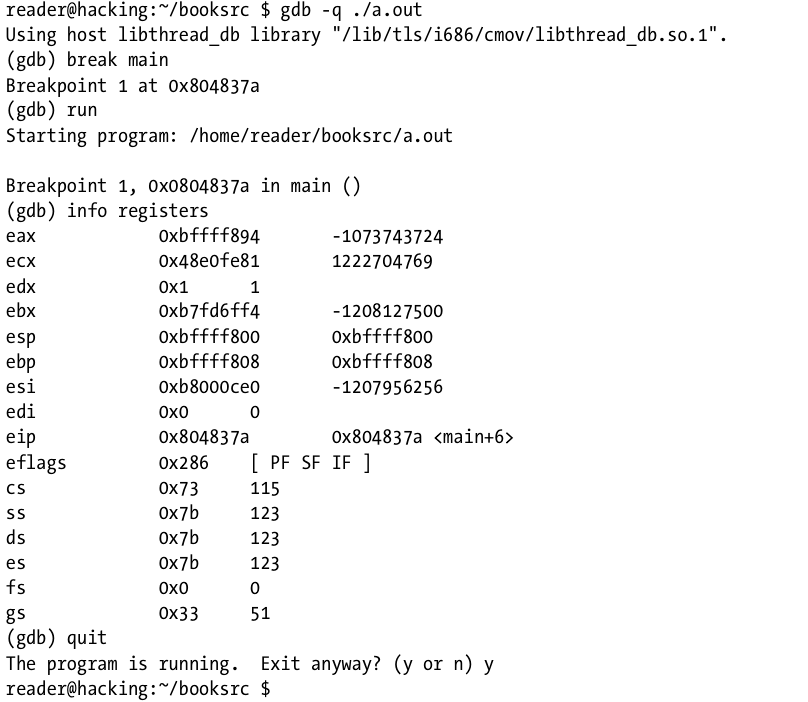
- x86_64 architecture (from my program)
    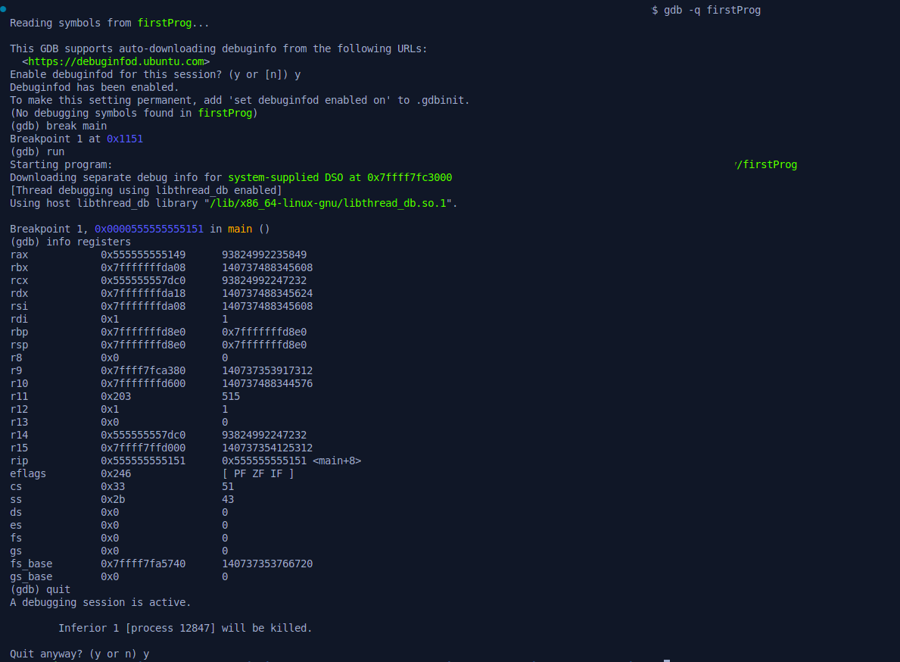
- The similarity of the program is on how the GDB commands to display the registers.
    - A breakpoint is set on the `main()` function (to stop the execution before the code is executed) through `(gdb) break main`.
    - Then the GDB runs the program with the program `(gdb) run` stops at the break point.
    - And the GDB passes the command `(gdb) info registers` to display all the processor registers and their current states.

The registers are the important part of both Assembly language and the debugging processes.
- The first four registers (`eax`, `ecx`, `edx`, `ebx` for x86 architecture and `rax`, `rcx`, `rdx`, `rbx` for x86_64 architecture) are **general-purpose registers**, which acts as temporary variables for the CPU when it’s executing machine instructions.
    - `e/r`**`ax`**: Accumulator registers
    - `e/r`**`cx`**: Counter registers
    - `e/r`**`dx`**: Data registers
    - `e/r`**`bx`**: Base registers
- The second four respective registers (`eax`, `ecx`, `edx`, `ebx` for x86 architecture and `rax`, `rcx`, `rdx`, `rbx` for x86_64 architecture) are both **pointers** and **indexes**.
    - **Pointer registers** store 32-bit/64-bit addresses.
        - `e/r`**`sp`**: Stack pointer
        - `e/r`**`bp`**: Base pointer
    - **Index registers** act as a source/destination pointers.
        - `e/r`**`si`**: Source index
        - `e/r`**`di`**: Destination index
- The Instruction Pointer register (represented by `e/r`**`ip`**) points the current instruction the processor is reading.
- Finally, the remaining `EFLAGS` register consists of several bit flags that are used for **comparisons and memory segmentations**.

### 0x153 Assembly language

Since the book follows the Intel guide, we’ll be using Intel as our disassembly syntax. Whenever we want to disassemble any objects/programs by using GDB, we can run the `set disassembly-flavor intel` to display all Assembly languages into Intel-based syntax.

```shell
> gdb -q 
...
(gdb) set disassembly-flavor intel
```

The Intel-based Assembly instructions generally follow this style:

```nasm
operation <destination>, <source>
```
- The destination and source values will either be a register, a memory address, or a value.
- The operations are often intuitive mnemonics, which are the lists are in the following:
    - `mov`: Move a value from the source to the destination
    - `sub`: Subtract a value
    - `inc`: Increment a value
    - And so forth
    
    ```nasm
    mov  ebp,esp
    sub  esp,0x8
    ```
    
    - The instructions above will move the value from ESP to EBP
    - Then, the EBP will subtract 8 from ESP, storing the result in ESP
- There are also operations that are used to control the flow of execution.
    - `cmp`: Compare values
        - Any operation beginning with `j` is used to jump to a different part of code.
    - `jle` (*jump if less than or equal to*): Refers to the result of the previous comparison
    
    ```nasm
    cmp  DWORD PTR [ebp-4],0x9
    jle  8048393 <main+0x1f>
    jmp  80483a6 <main+0x32>
    ```
    
    - The `DWORD PTR` compares a 4-byte value located at EBP minus 4 with the number 9
    - If the value (from `jle`) is less than or equal to 9, execution jumps to the instruction at `0x8048393`
        - Otherwise, execution flows to the next instruction with an unconditional jump
    - If the value isn’t less than or equal to 9, execution will jump to `0x80483a6`

Utilizing the debugger through GDB to step through the program at the assembly instruction level.

<aside>
🗒️

Depending on the GCC compiler, some objects that needed to be debugged or disassembled require `-g` flag to the compiler to include extra debugging information. This will provide the source code to the GDB.

```shell
> gcc -g firstProg.c -o firstProg-dbg
```

</aside>

Since I try to provide some of the following guides from `x86` and `x86_64`, note that there will be many differences on the compiler. The GDB compiler on `x86` from the book might be different with the latest GDB compiler, especially when it runs on `x86_64`, whether it runs on UNIX or Windows (through MinGW).

The first thing that we can identify the differences are when we disassemble the `main()` function on the program by running the following command.

```shell
(gdb) disassemble main

# Alternative command for simpler syntaxes
(gdb) disass main
```

- The disassembled `main()` in x86

    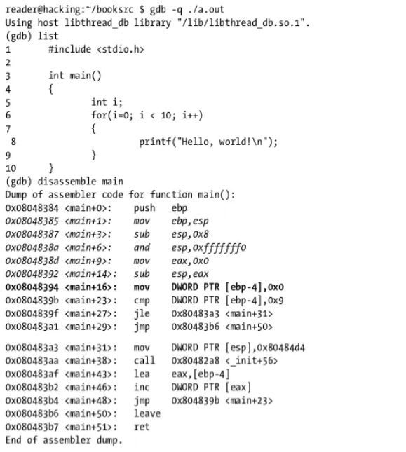

- The disassembled `main()` in x86_64 program

    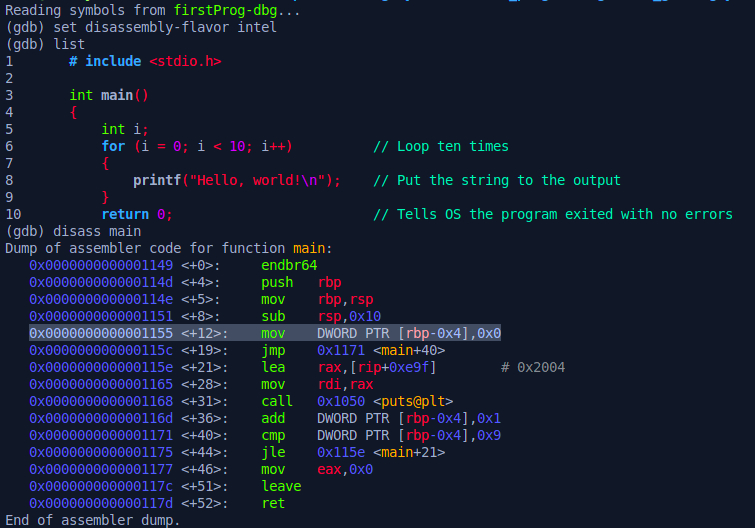

Next, a breakpoint is set at the start of `main()` and the program is run.

```shell
(gdb) break main

(gdb) run
```
After running the command above, we can identify the registers and pointers against the memory, whether in x86 or x86_64 architecture.

First things that we need to identify is examining the `EIP` register (`RIP` for x86_64), which stands of **Instruction Pointer**. This register contains a memory address that points to an instruction in the `main()` function.

- To begin with, we can run `info register eip/rip` command in the GDB shell.

    ```shell
    (gdb) info register eip/rip

    # Shorter syntax
    (gdb) i r eip/rip
    ```

- The instructions before the Instruction Pointer, is known as the *function prologue*.
    - The *function prologue*, which generated by the compiler, sets up a memory for the rest at the `main()`’s local variables.
    - Also known as initial set of instructions a function uses to set up its stack frame, which typically includes saving the base pointer and allocating space on the stack for local variables.
    - Here are the examples of the *function prologues* in different machine architectures before the `main()` instruction (`mov   DWORD PTR [e/rbp-0x4],0x0`), from both projects (x86-64 arch and x86 arch).
        - **x86-64**
            
            ```nasm
            0x0000000000001149 <+0>:     endbr64
            0x000000000000114d <+4>:     push   rbp
            0x000000000000114e <+5>:     mov    rbp,rsp
            0x0000000000001151 <+8>:     sub    rsp,0x10
            ```
        - **x86** (from the book)
            
            ```nasm
            0x08048385 <main+1>:     mov     ebp,esp
            0x08048387 <main+3>:     sub     esp,0x8
            0x0804838a <main+6>:     and     esp,0xfffffff0
            0x0804838d <main+9>:     mov     eax,0x0
            0x08048392 <main+14>:    sub     esp,eax
            ```
            
The GDB debugger provides a direct method to examine memory through the `x` command, as in ‘e`x`amine’. There is a functionality and usage that you can do with the `x` command.

- Look at the certain address of memory in a variety of ways, which requires two arguments
    - The location in memory to examine
    - How to display that memory

- The display format also uses a single-letter shorthand, which is optionally preceded by a count of how many items to examine. The common format letters are:
    - `x/`**`o`**: Display in **octal**.
    - `x/`**`x`**: Display in **hexadecimal**.
    - `x/`**`u`**: Display in **unsigned. standard base-10 decimal**.
    - `x/`**`t`**: Display in **binary**.

    ```shell
    (gdb) x/o $rip

    (gdb) x/x $rip

    (gdb) x/u $rip

    (gdb) x/t $rip
    ```
    
    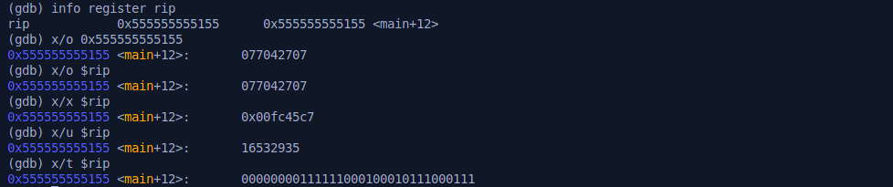

    - A number can also be prepended to the format of the examine command to examine multiple units at the target address.
    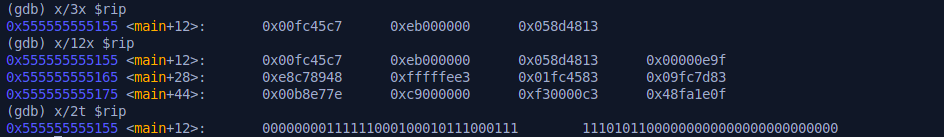

- A single unit is a four-byte unit called **a word**, which the valid size letters are:

    - **`b`**: A single byte
    - **`h`**: A halfword = two-bytes in size
    - **`w`**: A word = four-bytes in size
    - **`g`**: A giant = eight-bytes in size

    - Often, **a word** also refers to 2-byte values. In this case, a ***double word* (DWORD)** refers to a four-byte value.

- According from the book, if **a word** refers to four-byte values, which is as same as DWORD, the two-byte value referred to the *short* or halfword. Take a look at the following example shows the GDB output of memory displayed in various sizes.

    ```shell
    # The first eight-bytes of bigger units display more data in total.
    (gdb) x/8xb $rip

    # The halfword is examined at the exact same memory address, but the value 0x45c7 shows the bytes reversed.
    (gdb) x/8xh $rip

    # A full four-byte word 0x00fc45c7 is shown with the same byte-reversal effect.
    (gdb) x/8xw $rip

    # Eight giant eight-bytes of the Instruction Pointer.
    (gdb) x/8xg $rip
    ```

    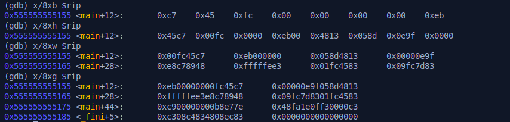

    - The memory address values are stored in **little-endian byte order**, which means least significant byte is stored first.

- The same case above applies on the following examples in both hexadecimal and unsigned (base-10) decimals.

    ```shell
    # Four hex single-bytes
    (gdb) x/4xb $rip

    # Four unsigned single-bytes
    (gdb) x/4ub $rip

    # One hex word
    (gdb) x/1xw $rip

    # One unsigned word
    (gdb) x/1uw $rip
    ```

    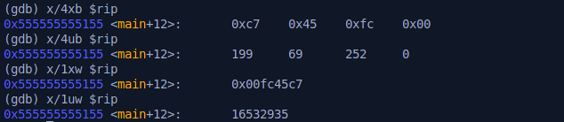

    - Here are the following calculations based on the memory address of words above, using UNIX-based CLI calculator (bc -ql).

        ```bash
        $ bc -ql
        # ---------------------------------------------------
        # 199*(256^3) + 69*(256^2) + 252*(256^1) + 0*(256^0)
        # 3343252480
        # ---------------------------------------------------
        # 0*(256^3) + 252*(256^2) + 69*(256^1) + 199*(256^0)
        # 16532935
        ```

        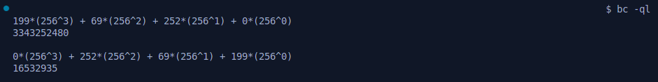

        - The byte order of a given architecture is an important detail to be aware of.
        - The little-endian shows the calculation below matches with the value of `x/1uw $rip`.

GDB can also do other conversions with the examine command, which is using the command `x/i`, short for `instruction`. The following example shows the `x/i` command to display the memory as disassembled assembly language instructions.

```shell
# Display instruction on RIP
(gdb) x/i $rip

# Display how many (n) instructions that will be examined
(gdb) x/ni $rip
```

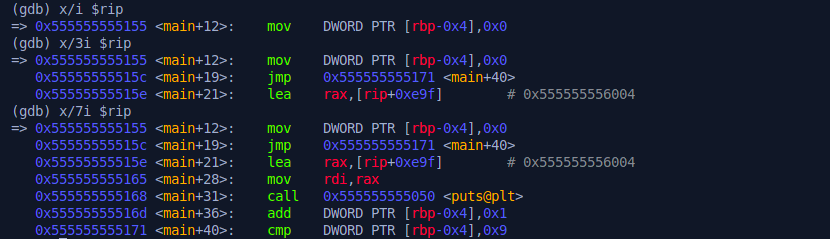

- The RIP register is pointing to memory that actually contains machine language instructions.

Refer back to the `main()` Assembly instruction from the results of `objdump`
```nasm
1155:       c7 45 fc 00 00 00 00    mov    DWORD PTR [rbp-0x4],0x0
```
- The instruction will move the value of 0 into memory located at the address stored in the **RBP register minus 4**, where the C variable `i` is stored, thus the `i` was declared as an integer that uses 4 bytes of memory.
- Basically, this command will zero out the variable `i` for the `for` loop, which stated like this following C code of [`firstProg.c`](firstProg.c) snippet.
    ```c
    ...
    for (i = 0; i < 10; i++)
    ...
    ```

Remember when I tried to disassemble the program in x64? If you can refer back to the `disass main` command, you see both x86 and x64 have differences, not only the `E/R` Assembly registers, but also the Assembly structure. Let's take a look.

- Here are three instructions after the `main()` in x86. You can compare it with the three same instructions in x64 above.
    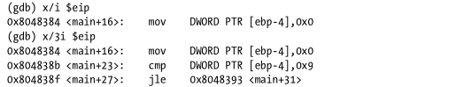

    - The behavior shows the next instruction after the `main()` instruction is the condition check or compare values `cmp`, which is comparing `i` with some numbers less than 10. This is bottom-test loop, meaning:

        - The loop body executes first.
        - The condition is checked after the body.
        - If the condition is true, it jumps back to the loop body.

- While in the aforementioned instructions in x64, the next instruction happens to be jump (`jmp`) before the `cmp` comparison, due to the compiler generated an explicit `jmp` to the condition check.

    - Compared to the x86, this is known as top-test loop, which means:

        - The condition is checked before entering the loop body.
        - The loop body only runs if the condition is true.
        - More efficient for cases where the loop might run zero times.

To identify the next instruction after the `main()`, we can run `nexti` in the GDB shell, which means `next instruction`. The processor will read the instruction at RIP, execute it, and advance RIP to the next instruction.

```shell
(gdb) nexti
```

- Here's the example of the instruction after running the `nexti` command.

    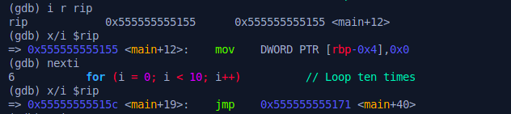
    
    - Next instruction through `x/i` of the current register RIP.

    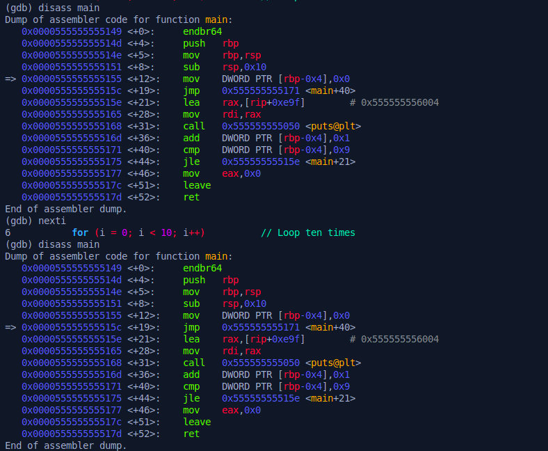

    - Next instruction through `disass main` (Notice on the arrow `=>` on the left side of the memory addresses).