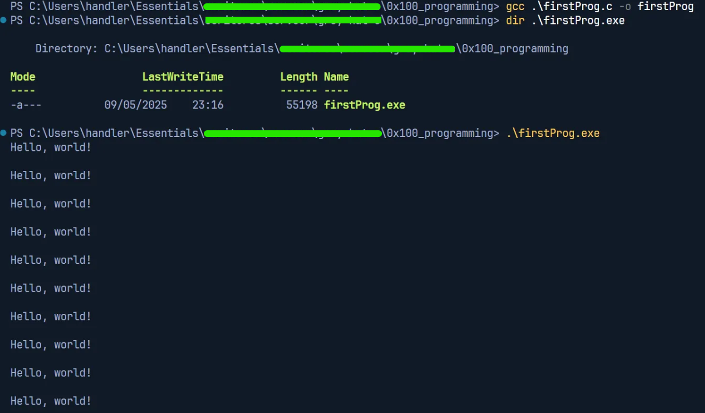
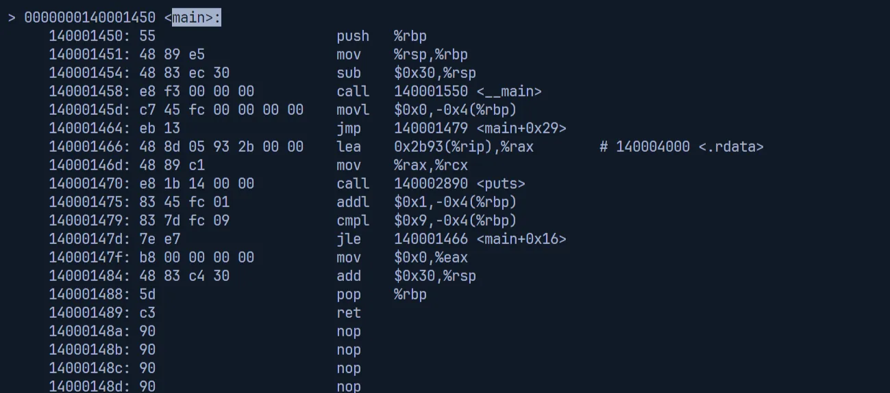
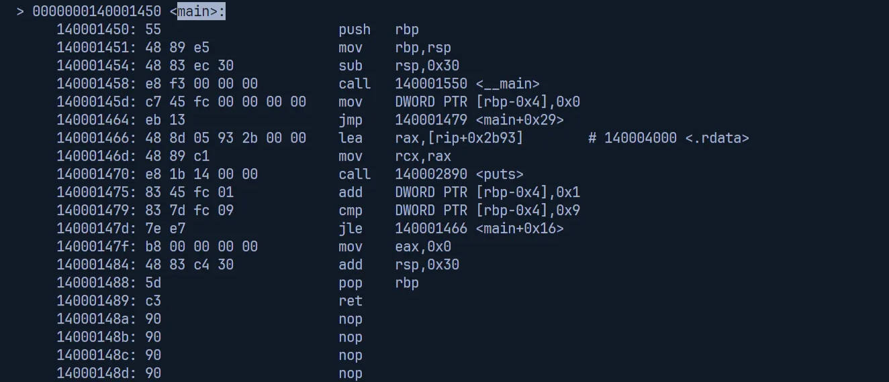

# 0x100 Programming

## 0x110 What is programming?

**Programming** is a series of instructions or statements written in a specific language. In terms of computer programming, it needs to converting it into a **machine language**, that consists of raw bits and bytes and it varies from architecture-to-architecture (i.e. Intel x86 or x86-x64). To communicate with a computer, the programming needs to be translated using **low-level** **assembler**, which is a program that translates **assembly language** into a machine code. Aside of the assembler, programming can also be translated with more **high-level** **compiler** to convert it into machine language.

An example of typical program for driving directions might look like this.

<aside>

Start out down Main Street headed east. Continue on Main Street until you see a church on your right. If the street is blocked because of construction, turn right there at 15th Street, turn left on Pine Street, and then turn right on 16th Street. Otherwise, you can just continue and make a right on 16th Street. Continue on 16th Street, and turn left onto Destination Road. Drive straight down Destination Road for 5 miles, and then you'll see the house on the right. The address is 743 Destination Road.

</aside>

## 0x120 Pseudo-code

Programmers write the idea from the English language into arranged general structure that similar to high-level programming languages (often like C), is known as **pseudo-code**. 

The following pseudo-code is somewhat translated from the typical program above.

```
Begin going East on Main Street;
While (there is not a church on the right)
	Drive down Main Street;
If (street is blocked)
{
	Turn right on 15th Street;
	Turn left on Pine Street;
	Turn right on 16th Street;
}
Else
	Turn right on 16th Street;
Turn left on Destination Road;
For (ctr=0; ctr<5; ctr++)
	Drive straight for 1 mile;
Stop at 743 Destination Road;
```

## 0x130 Control structures

<aside>
📚

The basic C functions below are likely similar or there are some differences from the C Essentials, that I’ve provided the PDF file in this folder repository.

</aside>

The program requires **control structures**, which is the flow of the program’s execution from a simple sequential order to a more complex and more useful flow.

The following sections are structures based on the pseudo-code above.

### 0x131 If-Then-Else

In general, the *if-then-else structure* pseudo-code looks something like this.

```
If (condition) then
{
	Set of instructions to execute **if** the condition is **met**;
}
Else
{
	Set of instructions to execute **if** the condition is **not met**;
}
```

The *if-then-else structure* pseudo-code based on the program example might look something like this.

```
If (street is blocked)
{
	Turn right on 15th Street;
	Turn left on Pine Street;
	Turn right on 16th Street;
}
Else
	Turn right on 16th Street;
```

The pseudo-code’s rule of thumb, which can also applicable in C codes/scripts.

```
If (there's only one instruction in a set of instructions)
	The use of curly braces to group the instructions is optional;
Else
{
	The use of curly braces is necessary;
	Since there must be a logical way to group these instructions;
}
```

Another variation of the *if-then-else* statements, the *select/case* statements, has the similar logic; if this happens do these things, otherwise do these other things.

### 0x132 While/Until Loops

The looping statements require a set of conditions that tells it when to stop looping, otherwise it will loop infinitely. The most common looping statement, the *while control structure* (a.k.a. *while loop*), says to execute the following set of instructions in a loop *while* a condition is true.

```
While (the person is hungry)
{
	Find some food;
	Eat the food;
}
```

- The looping stops if the condition has been achieved, meaning **the person is not hungry anymore**.

Another variation, the *until loop*, a syntax that exclusive to the programming language **Perl**. The difference is the condition inside of the *until loop* is inverted against the condition inside of the *while loop*.

```
Until (the person is **not** hungry)
{
	Find some food;
	Eat the food;
}
```

The *while loop* for the previous program case should be like this.

```
While (there is not a church on the right)
	Drive down Main Street;
```

- The driving directions state ***Continue on the Main Street util you see a church on the right***.

### 0x133 For Loops

The *for loops* often used when a programmer wants to loop for a certain number of iterations.

Consider the following example when a program is looped for five times.

```
For (5 iterations)
	Drive straight for a mile;
```

A *for loop* can also be considered as a *while loop +* counter, which can be converted into something like this. 

```
Set the counter to 0;
While (the counter is less than 5)
{
	Drive straight for a mile;
	Add 1 to the counter;
}
```

If the pseudo-code is converted into C-like with a touch of the example program (for driving directions), it will look like this, which even more apparent.

```
For (ctr=0; ctr<5; ctr++)
	Drive straight for a mile;
```

The *for loop* above consists of three sections, separated by semicolons.

- The first section, the `ctr` is declared as the counter and sets it to its initial value (`0`).
- The second section, the condition that is similar with a *while* statement using the counter: Keep looping until the condition has been achieved.
- The third section, sets what action should be taken on the counter during each iteration: Add 1 to the counter called `ctr`.

## 0x140 More fundamental programming concepts

Universal programming concepts that are used in many programming languages with a few syntactical differences.

### 0x141 Variables

**Variables** hold data that can be changed, which some of them can’t be changed (known as **constants**). Therefore, in C, variables must be declared and given a type before they can be used. All variables are stored in memory somewhere, as well as their declarations allow the compiler to organize this memory more efficiently.

The following snippets are the variables that often used in C scripts.

- `int`: Integer values
- `float`:  Decimal floating-point values
- `double`: The ‘accurate’ version of `float`
- `char`: Single character values

```c
// Variables
int a;
a = 76;
float k;
k = 9.62
char z;
z = 'z';

// Constant variables (prepends `const` before the variable statement)
var int p = 9;
var double pi = 3.14;
```

### 0x142 Arithmetic Operators

The following symbols are used in C for various arithmetic operations.

| **Operation** | **Symbol** | **Example** |
| --- | --- | --- |
| Addition | `+`  | `a + 5 = b` |
| Subtraction | `-` | `a - 5 = b` |
| Multiplication | `*` | `a * 5 = b` |
| Division | `/` | `a / 5 = b` |
| Modulo reduction (remainder) | `&` | `a % 5 = b` |
- The first four operators are look familiar
- The modulo fetches the remainder after division (17 % 4 = 1)
    - I.e. `29 % 7 = 1` ⇒ **29 divided by 7** equals 4 with a **remainder of 1**

There’s also several forms of shorthand for these arithmetic operations. One of the example is the **shorthand** that commonly used in *for loops*.

| **Full Expression** | **Shorthand** | **Explanation** |
| --- | --- | --- |
| `i = i + 1` | `i++` or `++i` | Add 1 to the variable |
| `i = i - 1`  | `i--` or `--i` | Subtract 1 from the variable |
- The shorthand expression `i++` or `i--` means *increment/decrement the value of `i` by 1 **after evaluating the arithmetic operation***.
    
    ```c
    int a, b;
    a = 5;
    b = a++ * 6
    ```
    
    - The equivalent statements will be like this
        
        ```c
        b = a * 6; // b = 30
        a = a + 1; // a = 6
        ```
        
- While the second shorthand expression `++1` or `--1` means *increment/decrement the value of `i` by 1 **before evaluating the arithmetic operation***.
    
    ```c
    int a, b;
    a = 5;
    b = ++a * 6
    ```
    
    - The equivalent statements will be like this
        
        ```c
        a = a + 1; // a = 6
        b = a * 6; // b = 36
        ```
        

Variables are often need to be modified in place. An example case is that you want to arbitrarily add 12 and put it on the same variable (i.e. `i = i + 12`). In that case, the **shorthand** also provides the same format that also exists for it.

| **Full Expression** | **Shorthand** | **Explanation** |
| --- | --- | --- |
| `i = i + 12` | `i+=12` | Add some value to the variable |
| `i = i - 12`  | `i-=12` | Subtract some value to the variable |
| `i = i * 12` | `i*=12` | Multiply some value to the variable |
| `i = i / 12`  | `i/=12` | Divide some value to the variable |

### 0x143 Comparison Operators

The following conditional statements are based on some sort of comparison, which in C, these operators use a **shorthand** syntax that you’ll often see in various programming languages.

| Condition | Symbol | Example |
| --- | --- | --- |
| Less than | `<` | `(a < b)` |
| Greater than | `>`  | `(a > b)` |
| Less than or equal to | `<=` | `(a <= b)` |
| Greater than or equal to | `>=`  | `(a >= b)` |
| Equal to | `==`  | `(a == b)` |
| Not equal to | `!=` | `(a != b)` |
- All of these operators are self-explanatory.
- While the exclamation point `!` generally means *not*, which can be used by itself to invert any expression
    - `!(a < b) == (a >= b)`

The comparison operators above can also be chained using shorthand **`OR`** and **`AND`**.

- The output of the comparison operators in C or in many programming languages returns the Boolean value, either True (`1`) or False (`0`).

| **Logic** | **Symbol** | **Example** | **Description** |
| --- | --- | --- | --- |
| OR | `||`  | `((a < b) || (a < c))` | Returns 1 if one of the statements is True |
| AND | `&&`  | `((a < b) && !(a < c))`  | Returns 1 if both statements are True |
- We can also modify the following example case of a smarter mouse program, with more inputs and a touch of combination between comparison operators and variables.
    
    ```
    While ((hungry) && !(cat_present))
    {
    	Find some food;
    	If (!(food_is_on_a_mousetrap))
    		Eat the food;
    }
    ```
    

### 0x144 Functions

**Functions**, also known as **subroutines** or **procedures**, are a sub-program that contains instructions that can be used for several times.

By default in C, the functions can return a value to  a caller. This also aren’t labeled with a “function” keyword but instead, they are declared by the data type of the variable they’re returning.

Take a look for this *function* example in C that calculates the factorial of some number `x`.

```c
int factorial(int x)
{
	int i;
	for (i = 1; i < x; i++)
		x *= 1;
	return x;
}
```

- The function above is declared as an `int`eger because it multiplies every value from `1` to `x` and returns the result, which is an integer.
- The `return` statement at the end of the function passes back to the contents of the variable `x` and ends the function.
- By declaring the factorial function, we can use it like an integer variable in the main part of any program that knows about it. Plus it can be used several times depending on the use-cases.
    
    ```c
    int a = 5; b;
    b = factorial (a);
    // The `b` value is 120
    ```
    

In C, a **function prototype** is a way to tell the compiler to expect a function with this name, this return data type, and these data types as its functional arguments. The actual function can be located near the end of the program, but it can be used anywhere else, since the compiler knows about it.

```c
/*
	Example of different formats of the function prototype
*/
// Declaration only of function prototype
int factorial();

// Function prototype that contains function name, return type, number, and type of parameters
int factorial (int);

// Also a valid prototype
int factorial (int x);

// Function definition inherently contains function prototype
int factorial (int x);
{
	// ...SNIP...
}
```

## 0x150 Getting your hands dirty

The `firstProg.c` program is a simple C code that will print “`Twenty years in the can!`” ten times.

```c
# include <stdio.h>

int main()
{
    int i;
    for(i = 0; i < 10; i++)                 // Loop 10 times
    {
        puts("Twenty years in the can!\n"); // Put the string to the output
    }
    return 0;                               // Tells OS the program exited without errors
}
```

Compiling the code using GCC.

- In UNIX/WSL, it requires `gcc` installed
- In PowerShell, installing `gcc` can be done through MinGW



<aside>
💡

If you follow along with the guides from the book (that I will try to reproduce), this compiler runs on x86-64 architecture. If you try to compile with 32-bit machine (which is x86 architecture), you can add the `-m32` flag.

```bash
> gcc -m32 .\firstProg.c -o firstProg32

> .\firstProg32
```

Note that this only supports x86 machine, as newer versions have error compiling due to the unsupported architecture.

</aside>

### 0x151 The Bigger Picture

Compiling the `firstProg` with `objdump`, which is a GNU compiler to examine the executables/binaries that translates the high-level programming language, as in C, into the low-level language, as in the machine code.

```bash
# If using Bash/UNIX shell
$ objdump -D .\firstProg.exe | grep -A20 main.:

# If using PowerShell
PS C:\..\> objdump -D .\firstProg.exe | Select-String -Pattern 'main.:' -Context 0,20
```

- Using AT&T syntax (default option)
    
    
    
- Using Intel syntax (add `-M intel` option flag on the previous `objdump` command)
    
    
    

Let’s define each sections of the results of `objdump` output command.

- The `objdump` displays **only 20 lines after the regular expression (regex) `main.:`**.
- **Memory addresses**: The far-left side of the output (`0x140001450`) is the address that stores the bits of the machine language instructions.
- **Hexadecimal notation** bits (`0x55`, then `0x48 0x89 0x85`) that are stored in the respective memory addresses, are the **language instructions** on the respective processor (**x64 processor**).
    - While x86 architecture uses 32-bit processors, which have 2^32 possible addresses, the x64 architecture uses 64-bit processors, which have 2^48 possible addresses.
    - Some x64 architecture can run 32-bit compatibility mode, which enables them to run 32-bit code rapidly.
- On the far-right side, these are the instructions in Assembly language.

The Assembly language, which is a collection of mnemonics for the corresponding machine language instructions.

- This means depending on the architecture, the Assembly have direct one-to-one relationship with their corresponding machine language instructions.
- Based on the examples above, the AT&T and Intel syntax have different representations of the Assembly syntaxes.
    - The Assembly language of AT&T syntax has the cacophony/noise of `%` and `$` symbols prefixing everything, compared to the Intel, which has none of them.
- Regardless of the Assembly language representation, the instructions consists of an operation, and additional arguments that defines the source and destination of the operation.
    - These operations move memory around, perform some mathematical tasks, or interrupt the processor to work on something else.
    - Processors also have special variables called ***registers***, that they use it to read or write data.

### 0x152 The x86 Processor

The x86 processor/architecture starts from the 8086 CPU, manufactured by Intel. The same architecture has several registers, which can be examined through debugging.

The ***debugger*** tools are used by programmers to step through compiled programs, examine program memory, and view processor registers. The GNU development tools has a debugger called **GDB**.

- The same tool allows a hacker to observe the smallest point-of-view of machine code, which they can view the execution from all angles, pause it, and change anything along the way.

An example of the GDB to display the state of the processor registers right before the program starts.

- x86 architecture (from the book)
    
    
    
- x86-64 architecture (from my program)
    
    
    
- The similarity of the program is on how the GDB commands to display the registers.
    - A breakpoint is set on the `main()` function (to stop the execution before the code is executed) through `(gdb) break main`.
    - Then the GDB runs the program with the program `(gdb) run` stops at the break point.
    - And the GDB passes the command `(gdb) info registers` to display all the processor registers and their current states.

The registers are the important part of both Assembly language and the debugging processes.

- The first four registers (`eax`, `ecx`, `edx`, `ebx` for x86 architecture and `rax`, `rcx`, `rdx`, `rbx` for x64 architecture) are **general-purpose registers**, which acts as temporary variables for the CPU when it’s executing machine instructions.
    - `e/r**ax**`: Accumulator registers
    - `e/r**cx**`: Counter registers
    - `e/r**dx**`: Data registers
    - `e/r**bx**`: Base registers
- The second four respective registers (`eax`, `ecx`, `edx`, `ebx` for x86 architecture and `rax`, `rcx`, `rdx`, `rbx` for x64 architecture) are both **pointers** and **indexes**.
    - **Pointer registers** store 32-bit/64-bit addresses.
        - `e/rsp`: Stack pointer
        - `e/rbp`: Base pointer
    - **Index registers** act as a source/destination pointers.
        - `e/rsi`: Source index
        - `e/rdi`: Destination index
- The Instruction Pointer register (represented by `e/rip`) points the current instruction the processor is reading.
- Finally, the remaining `EFLAGS` register consists of several bit flags that are used for **comparisons and memory segmentations**.

### 0x153 Assembly Language

Since the book follows the Intel guide, we’ll be using Intel as our disassembly syntax.

```bash
> gdb -q .\firstProg.exe
...
(gdb) set disassembly-flavor intel
```

The Intel-based Assembly instructions generally follow this style:

```nasm
operation <destination>, <source>
```

- The destination and source values will either be a register, a memory address, or a value.
- The operations are often intuitive mnemonics, which are the lists are in the following:
    - `mov`: Move a value from the source to the destination
    - `sub`: Subtract a value
    - `inc`: Increment a value
    - And so forth
    
    ```nasm
    mov  ebp,esp
    sub  esp,0x8
    ```
    
    - The instructions above will move the value from ESP to EBP
    - Then, the EBP will subtract 8 from ESP, storing the result in ESP
- There are also operations that are used to control the flow of execution.
    - `cmp`: Compare values
        - Any operation beginning with `j` is used to jump to a different part of code.
    - `jle` (*jump if less than or equal to*): Refers to the result of the previous comparison
    
    ```nasm
    cmp  DWORD PTR [ebp-4],0x9
    jle  8048393 <main+0x1f>
    jmp  80483a6 <main+0x32>
    ```
    
    - The `DWORD PTR` compares a 4-byte value located at EBP minus 4 with the number 9
    - If the value (from `jle`) is less than or equal to 9, execution jumps to the instruction at `0x8048393`
        - Otherwise, execution flows to the next instruction with an unconditional jump
    - If the value isn’t less than or equal to 9, execution will jump to `0x80483a6`

Utilizing the debugger through GDB to step through the program at the assembly instruction level.

<aside>
🗒️

We created a new executable `firstProg-dbg.exe` through the `-g` flag from the compiler to include extra debugging information, which will provide the source code to the GDB.

</aside>


- The GDB is run against the newly created program `firstProg-dbg.exe`.
- The source code is listed and the disassembly of the `main()` function is displayed.


- A breakpoint is set at the start of `main()` and the program is run.


- The RIP (x64-arch Instruction Pointer) exists, which contains a memory address that points to an instruction in the `main()` function.
- The instructions before the Instruction Pointer, is known as the *function prologue*.
    - The *function prologue*, which generated by the compiler, sets up a memory for the rest at the `main()`’s local variables.
    - Also known as initial set of instructions a function uses to set up its stack frame, which typically includes saving the base pointer and allocating space on the stack for local variables.
    - Here are the examples of the *function prologue* in different machine architectures before the , from both of my project (x86-64 arch and x86 arch).
        - **x86-64**
            
            ```nasm
            0x0000000140001450 <+0>:     push   rbp
            0x0000000140001451 <+1>:     mov    rbp,rsp
            0x0000000140001454 <+4>:     sub    rsp,0x30
            ```
            
        - **x86** (from the book)
            
            ```nasm
            0x08048385 <main+1>:     mov     ebp,esp
            0x08048387 <main+3>:     sub     esp,0x8
            0x0804838a <main+6>:     and     esp,0xfffffff0
            0x0804838d <main+9>:     mov     eax,0x0
            0x08048392 <main+14>:    sub     esp,eax
            ```
            

The GDB debugger provides a direct method to examine memory through the `x` command, as in ‘e`x`amine’. There is a functionality and usage that you can do with the `x` command.

- Look at the certain address of memory in a variety of ways, which requires two arguments
    - The location in memory to examine
    - How to display that memory

The following ASCII table […].


Source: [ASCII Values Alphabets ( A-Z, a-z & Special Character Table ) | GeeksforGeeks](https://www.geeksforgeeks.org/ascii-table/)

